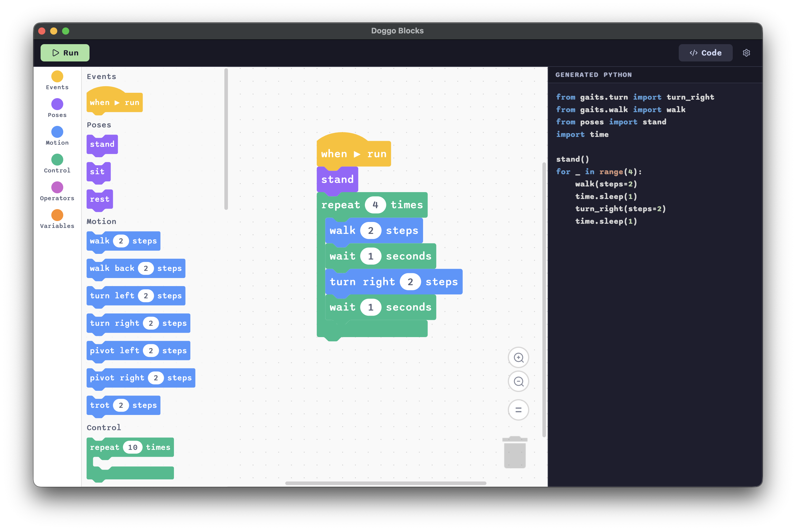

<h1 align="center">Doggo Blocks</h1>

<p align="center">
  
</p>

Block-based programming for the Petoi Bittle X V2. Drag blocks to build a sequence of moves, then hit **Run** to send the program to the robot over Wi-Fi.

<p align="center">
  
</p>

## Prerequisites

- Node.js 18+
- The robot on Wi-Fi with WebREPL enabled (see `../docs/hardware-setup.md`)
- Python with `mpremote` installed (`pip install mpremote`)

## Running in development

```bash
cd doggo-blocks
npm install
cp -r node_modules/scratch-blocks/media public/media   # copies workspace icons (gitignored)
npm start
```

The Electron window opens. DevTools are available with Cmd+Option+I (hidden in the packaged build).

## Building a packaged app

```bash
npm run package
```

The app is output to `out/DoggoBlocks-darwin-arm64/DoggoBlocks.app` (path varies by platform).

## Configuration

Click the **gear icon ⚙** in the toolbar to open Settings. Enter:

- **Robot hostname** — the mDNS hostname of your robot (default: `doggo.local`)
- **Robot password** — the WebREPL password set in `wifi_config.py` on the device (default: `doggo`)

Settings are saved automatically and persist across launches.

## Using the app

1. **Splash screen** — click **Get Started** to open the workspace.
2. **Build a program** — drag blocks from the palette on the left into the workspace.
3. **Hit Run ▶** — the workspace is compiled to a MicroPython script and sent to the robot via `webrepl_proxy.py`. Progress is shown in the toolbar.
4. **Errors** — if the script exits with a non-zero code, a popup shows the full output. Common errors (hostname not found, wrong password, connection timeout) display a plain-English message instead of a raw traceback.

## Block categories

| Category | Colour | What it does |
|----------|--------|-------------|
| **Poses** | Purple | `stand`, `sit`, `rest` — single static positions |
| **Motion** | Blue | `walk`, `walk back`, `turn left/right`, `pivot left/right`, `trot` — all take a `steps` count |
| **Control** | Teal | `repeat N times`, `forever`, `while <condition>` — C-shaped loop blocks |
| **Operators** | Green | Arithmetic (`+` `-` `×` `÷`) and comparisons (`<` `>` `=` `≤` `≥`) and logic (`and` `or` `not`) |
| **Variables** | Orange | Click **Make a Variable** to create named variables; `set` and `get` blocks appear automatically |

A **Wait** block (under Control) pauses execution for a given number of seconds.


## How it works

1. Blocks generate a MicroPython script via Blockly's code generator.
2. The script is written to a temp file and passed to `python ../webrepl_proxy.py run <script>`.
3. `webrepl_proxy.py` connects to the robot's WebREPL WebSocket using the hostname and password from Settings, authenticates, and runs the script via `mpremote`.
4. stdout and stderr are both streamed back to the app. On success, the toolbar shows **Done ✓**. On failure, an error popup shows the full output.
