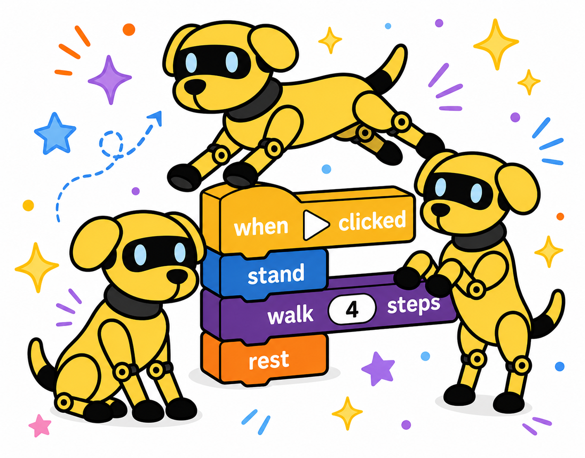

<h1 align="center">Doggo Blocks</h1>

<p align="center">
  
</p>

Block-based programming for the Petoi Bittle X V2. Drag blocks to build a sequence of moves, then hit **Run** to send the program to the robot over Wi-Fi.

## Prerequisites

- Node.js 18+
- The robot on Wi-Fi with WebREPL enabled (see `../docs/hardware-setup.md`)
- `wifi_config.py` present in the repo root (copy from `wifi_config_template.py` and fill in credentials)
- Python dependencies for `webrepl_proxy.py`: `mpremote` installed (`pip install mpremote`)

## Running

```bash
cd doggo-blocks
npm install
cp -r node_modules/scratch-blocks/media public/media   # copies workspace icons (gitignored)
npm start
```

The Electron window opens. DevTools are available with Cmd+Option+I.

## Using the app

1. **Build a program** — drag blocks from the palette on the left into the workspace.
2. **Hit Run ▶** — the workspace is compiled to a MicroPython script and sent to the robot via `webrepl_proxy.py run`. Output and errors appear in DevTools console.
3. **Hit Stop ■** — sends SIGTERM to the running proxy process.

## Block categories

| Category | Colour | What it does |
|----------|--------|-------------|
| **Poses** | Purple | `stand`, `sit`, `rest` — single static positions |
| **Motion** | Blue | `walk`, `walk back`, `turn left/right`, `pivot left/right`, `trot` — all take a `steps` count |
| **Control** | Teal | `repeat N times`, `forever`, `while <condition>` — C-shaped loop blocks |
| **Operators** | Green | Arithmetic (`+` `-` `×` `÷`) and comparisons (`<` `>` `=` `≤` `≥`) and logic (`and` `or` `not`) |
| **Variables** | Orange | Click **Make a Variable** to create named variables; `set` and `get` blocks appear automatically |

A **Wait** block (under Control) pauses execution for a given number of seconds.

## Example program

```
stand
repeat 3 times
  walk  2  steps
  turn left  1  steps
wait  1  seconds
rest
```

Generates and runs:

```python
from poses import stand, rest
from gaits.walk import walk
from gaits.turn import turn_left
import time

stand()
for _ in range(3):
    walk(steps=2)
    turn_left(steps=1)
time.sleep(1)
rest()
```

## How it works

1. Blocks generate a MicroPython script using Blockly's code generator.
2. The script is written to a temp file and passed to `python ../webrepl_proxy.py run <script>`.
3. `webrepl_proxy.py` connects to the robot's WebREPL WebSocket, authenticates, and runs the script via `mpremote`.
4. stdout is streamed to the DevTools console; stderr is logged server-side.
